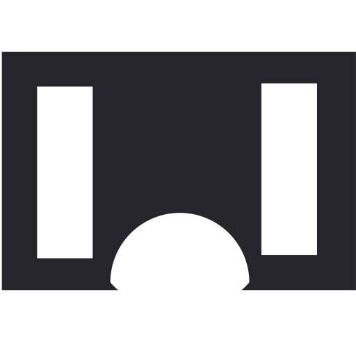

# Log --OpenSource Blog App [Incomplete]

- A blog where you can log your works
- Have multiple users so you can read others experiences

## Frontend

1.  Rect Js
2.  css

> Only frontend is kinda complete, working on API

## Backend

1. Node js
2. Mysql

`Inspired by `<a href="https://www.dev.to" >Dev.to</a>
